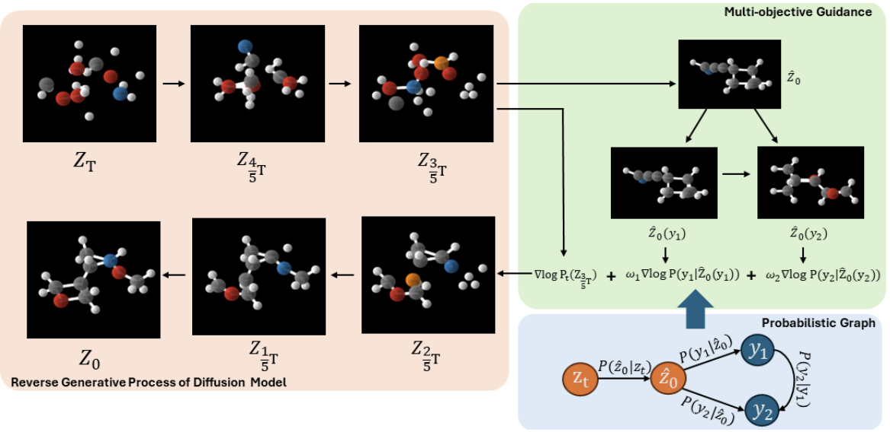
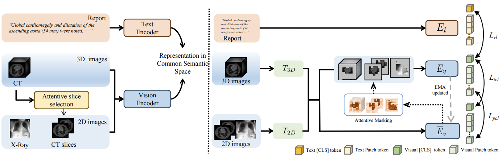
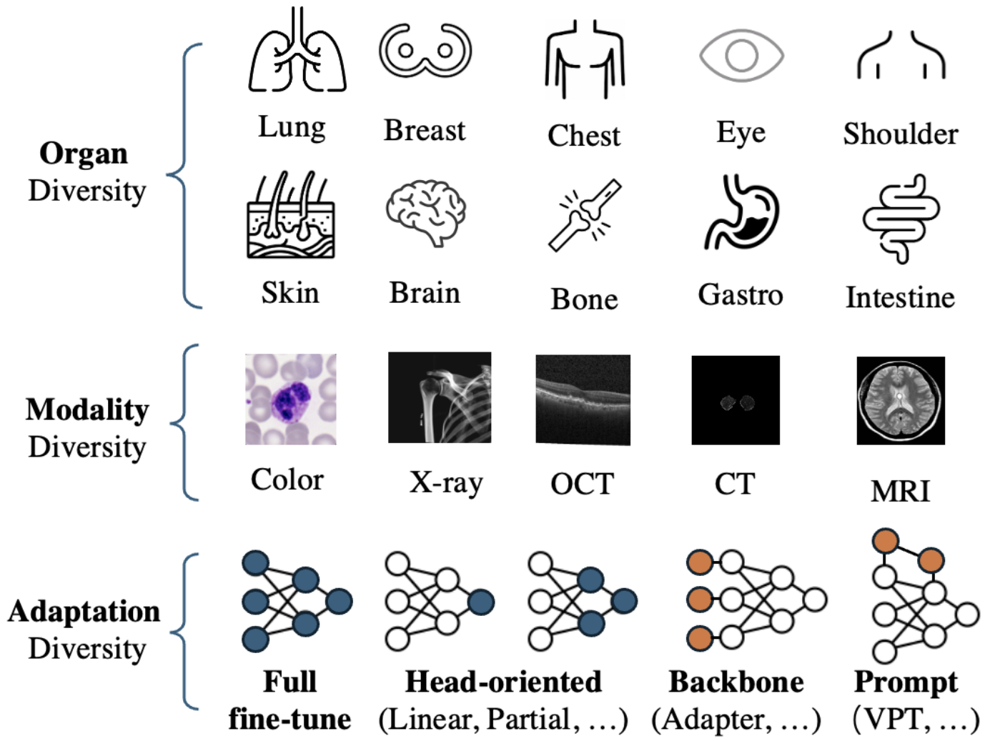

## Overview

In this project, we are interested in applying cutting-edge machine learning techniques to real-world healthcare problems, aiming to use AI to enhance the productivity of doctors and medical researchers.

- **AI-aided speech therapy**: We propose deep learning-based algorithms to detect and estimate hypernasality in patients with cleft lip and palate.
- **AI-based drug discovery**: We develop new drug combination algorithms for more effective cancer treatments and design innovative diffusion algorithms for flexible molecule generation.
- **Medical image analysis**: We aim to improve the performance of ultrasound localization microscopy in medical ultrasound videos and develop effective pretraining and finetuning techniques for medical image foundation models.

### AI-aided Speech Therapy

Hypernasality is an abnormal resonance in human speech production, especially in patients with craniofacial anomalies such as cleft palate. In clinical application, hypernasality estimation is crucial in cleft palate diagnosis, as its results determine the subsequent surgery and additional speech therapy. Therefore, designing an automatic hypernasality assessment method will facilitate speech-language pathologists to make precise diagnoses.

Existing methods for hypernasality estimation only conduct acoustic analysis based on low-resource cleft palate dataset, by using statistical or neural network-based features. We propose a novel approach that uses automatic speech recognition model to improve hypernasality estimation. Specifically, we first pre-train an encoder-decoder framework in an automatic speech recognition (ASR) objective by using speech-to-text dataset, and then fine-tune ASR encoder on the cleft palate dataset for hypernasality estimation. Benefiting from such design, our model for hypernasality estimation can enjoy the advantages of ASR model: 1) compared with low-resource cleft palate dataset, the ASR task usually includes large-scale speech data in the general domain, which enables better model generalization; 2) the text annotations in ASR dataset guide model to extract better acoustic features [Song et al., INTERSPEECH 2022][^1].

Pronunciation assessment is a major challenge in the computer-aided pronunciation training system, especially at the word (phoneme)-level. To obtain word (phoneme)-level scores, current methods usually rely on aligning components to obtain acoustic features of each word (phoneme), which limits the performance of assessment to the accuracy of alignments. Therefore, to address this problem, we propose a simple yet effective method, namely \underline{M}asked pre-training for \underline{P}ronunciation \underline{A}ssessment (MPA). Specifically, by incorporating a mask-predict strategy, our MPA supports end-to-end training without leveraging any aligning components and can solve misalignment issues to a large extent during prediction. Furthermore, we design two evaluation strategies to enable our model to conduct assessments in both unsupervised and supervised settings [Liang et al., INTERSPEECH 2023][^2].

### AI-based Drug Discovery

AI is playing an increasingly critical role in drug discovery across various aspects, such as drug combination and drug generation.

Drug combinations can enhance therapeutic efficacy and reduce toxicity, playing an important role in the treatment of various complex diseases. For example, the cocktail therapy for treating AIDS is a successful case of drug combination therapy. However, the ability to identify and validate effective combinations is limited by the explosive growth of possible drug combinations, and manual screening requires a large amount of manpower and experimentation. Recently, we proposed a new type of neural network, which can model biological processes within single cells and predict various patient indicators, such as drug efficacy. This work is now under review.

Searching for novel and diverse molecular candidates is a critical undertaking in drug discovery. Existing approaches have successfully adapted the diffusion model, the most effective generative model in image generation, to create 1D SMILES strings, 2D chemical graphs, or 3D molecular conformers. However, these methods are not efficient and flexible enough to generate 3D molecules with multiple desired properties, as they require additional training for the models for each new property or even a new combination of existing properties. In this work, we propose a training-free conditional 3D molecular generation algorithm based on off-the-shelf unconditional diffusion models and property prediction models. Our proposed model achieves superior performance in generating molecules that meet the conditions, without any additional training cost [Han et al., ICLR 2024][^3].

### Medical Image Analysis

We aim to develop effective pretraining and finetuning techniques for medical vision-language foundation models.

Vision-Language Pre-training (VLP) has shown the merits of analysing medical images, by leveraging the semantic congruence between medical images and their corresponding reports. However, such observation is predominantly justified on single-modality data (mostly 2D images like X-rays), adapting VLP to learning unified representations for medical images in real scenario remains an open challenge. This arises from medical images often encompass a variety of modalities, especially modalities with different various number of dimensions (e.g., 3D images like Computed Tomography). To overcome the aforementioned challenges, we propose an Unified Medical Image Pre-training framework, namely UniMedI, which utilizes diagnostic reports as common semantic space to create unified representations for diverse modalities of medical images (especially for 2D and 3D images). UniMedI has demonstrated superior performance in downstream tasks, such as classification, segmentation, and retrieval, showcasing its effectiveness in establishing a universal medical visual representation [He et al., ECCV 2024][^4].

Visual task adaptation has been demonstrated to be effective in adapting pre-trained Vision Transformers (ViTs) to general downstream visual tasks using specialized learnable layers or tokens. However, there is yet a large-scale benchmark to fully explore the effect of visual task adaptation on the realistic and important medical domain, particularly across diverse medical visual modalities, such as color images, X-ray, and CT. To close this gap, we present Med-VTAB, a large-scale Medical Visual Task Adaptation Benchmark consisting of 1.68 million medical images for diverse organs, modalities, and adaptation approaches. Based on Med-VTAB, we explore the scaling law of medical prompt tuning concerning tunable parameters and the generalizability of medical visual adaptation using non-medical/medical pre-train weights. Besides, we study the impact of patient ID out-of-distribution on medical visual adaptation, which is a real and challenging scenario. Furthermore, results from Med-VTAB indicate that a single pre-trained model falls short in medical task adaptation. Therefore, we introduce GMoE-Adapter, a novel method that combines medical and general pre-training weights through a gated mixture-of-experts adapter, achieving state-of-the-art results in medical visual task adaptation [Mo et al., arXiv 2024][^5].

## What's New

## Reference

[^1]: [Kaitao Song, Teng Wan, Bixia Wang, Huiqiang Jiang, Luna Qiu, Jiahang Xu, Liping Jiang, Qun Lou, Yuqing Yang, Dongsheng Li, Xudong Wang, Lili Qiu. Improving Hypernasality Estimation with Automatic Speech Recognition in Cleft Palate Speech. INTERSPEECH 2022.](https://arxiv.org/abs/2208.05122)

[^2]: [Yukang Liang, Kaitao Song, Shaoguang Mao, Huiqiang Jiang, Luna Qiu, Yuqing Yang, Dongsheng Li, Linli Xu, Lili Qiu. End-to-End Word-Level Pronunciation Assessment with MASK Pre-training. INTERSPEECH 2023.](https://arxiv.org/abs/2306.02682)

[^3]: [Xu Han, Caihua Shan, Yifei Shen, Can Xu, Han Yang, Xiang Li, Dongsheng Li. Training-free Multi-objective Diffusion Model for 3D Molecule Generation. ICLR 2024.](https://openreview.net/forum?id=X41c4uB4k0)

[^4]: [Xiaoxuan He, Yifan Yang, Xinyang Jiang, Xufang Luo, Haoji Hu, Siyun Zhao, Dongsheng Li, Yuqing Yang, Lili Qiu. Unified Medical Image Pre-training in Language-Guided Common Semantic Space. ECCV 2024.](https://arxiv.org/abs/2311.14851)

[^5]: [Shentong Mo, Xufang Luo, Yansen Wang, Dongsheng Li. A Large-scale Medical Visual Task Adaptation Benchmark. arXiv 2024.](https://arxiv.org/abs/2404.12876)
