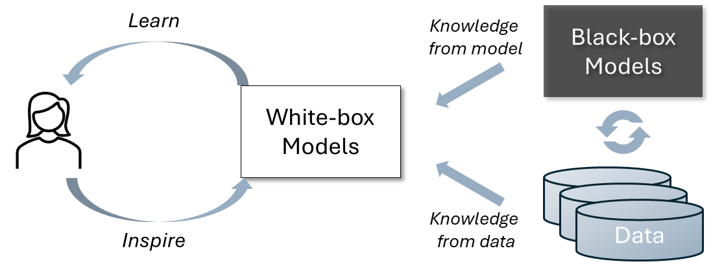

## Overview

In this project, we are focused on explainable machine learning to help people better understand AI models and to enhance human learning by unveiling the hidden knowledge within today's advanced AI systems.

- **Explainable machine learning**: We propose new techniques for understanding time series models, graph neural networks, and computer vision models.
- **AI-aided knowledge discovery and learning**: We leverage cutting-edge AI models to facilitate human learning and to discover new knowledge from AI models.

### Time Series Explanation

Shapelets and CNN are two typical approaches to model time series. Shapelets aim at finding a set of sub-sequences that extract feature-based interpretable shapes, but may suffer from accuracy and efficiency issues. CNN performs well by encoding sequences with a series of hidden representations, but lacks interpretability. In this work, we demonstrate that shapelets are essentially equivalent to a specific type of CNN kernel with a squared norm and pooling. Based on this finding, we propose ShapeConv, an interpretable CNN layer with its kernel serving as shapelets to conduct time-series modeling tasks in both supervised and unsupervised settings [Qu et al., ICLR 2024][^1].

### GNN Explanation

Graph neural networks (GNNs) have recently emerged as revolutionary technologies for machine learning tasks on graphs. Given a trained GNN model, a GNN explainer aims to identify a most influential subgraph to interpret the prediction of an instance (e.g., a node or a graph), which is essentially a combinatorial optimization problem over graph. 

The existing works solve this problem by continuous relaxation or search-based heuristics. But they suffer from key issues such as violation of message passing and hand-crafted heuristics, leading to inferior interpretability. To address these issues, we propose a RL-enhanced GNN explainer, RG-Explainer, which could construct a connected explanatory subgraph by sequentially adding nodes from the boundary of the current generated graph, which is consistent with the message passing scheme. Extensive experiments on both synthetic and real datasets show that RG-Explainer outperforms state-of-the-art GNN explainers [Shan et al., NeurIPS 2021][^2]. 

Due to the prevalence of temporal graphs, many temporal graph models have been proposed, but explaining their predictions remains to be explored. To bridge the gap, we propose T-GNNExplainer for temporal graph model explanation. To the best of our knowledge, T-GNNExplainer is the first explainer tailored for temporal graph models. Experimental results on both real-world and synthetic datasets demonstrate that T-GNNExplainer can achieve superior performance with up to about 50% improvement in Area under Fidelity-Sparsity Curve [Xia et al., ICLR 2023][^3]. 

## What's New

## Reference

[^1]: [Eric Qu, Yansen Wang, Xufang Luo, Wenqiang He, Kan Ren, Dongsheng Li. CNN Kernels Can Be the Best Shapelets. ICLR 2024.](https://openreview.net/pdf?id=O8ouVV8PjF)

[^2]: [Caihua Shan, Yifei Shen, Yao Zhang, Xiang Li, Dongsheng Li. Reinforcement Learning Enhanced Explainer for Graph Neural Networks. NeurIPS 2021.](https://proceedings.neurips.cc/paper_files/paper/2021/file/be26abe76fb5c8a4921cf9d3e865b454-Paper.pdf)

[^3]: [Wenwen Xia, Mincai Lai, Caihua Shan, Yao Zhang, Xinnan Dai, Xiang Li, Dongsheng Li. Explaining Temporal Graph Models through an Explorer-Navigator Framework. ICLR 2023.](https://openreview.net/pdf?id=BR_ZhvcYbGJ)
