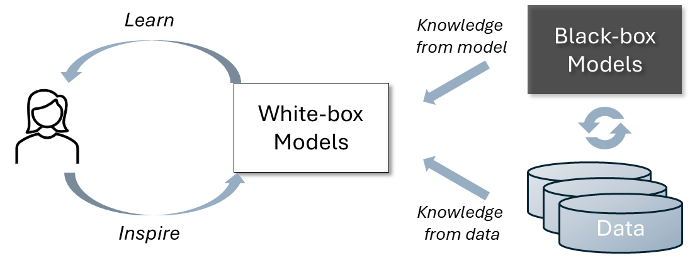

## Overview

In this project, we are focused on explainable machine learning to help people better understand AI models and to enhance human learning by unveiling the hidden knowledge within today's advanced AI systems.

- **Explainable machine learning**: We propose new techniques for understanding time series models, graph neural networks, and computer vision models.
- **Foundation model learning and reasoning**: We study how foundation models acquire, transfer, compress, and preserve knowledge during training, adaptation, and inference.
- **AI-aided knowledge discovery and learning**: We leverage cutting-edge AI models to facilitate human learning and to discover new knowledge from AI models.

### Time Series Explanation

Shapelets and CNN are two typical approaches to model time series. Shapelets aim at finding a set of sub-sequences that extract feature-based interpretable shapes, but may suffer from accuracy and efficiency issues. CNN performs well by encoding sequences with a series of hidden representations, but lacks interpretability. In this work, we demonstrate that shapelets are essentially equivalent to a specific type of CNN kernel with a squared norm and pooling. Based on this finding, we propose ShapeConv, an interpretable CNN layer with its kernel serving as shapelets to conduct time-series modeling tasks in both supervised and unsupervised settings [Qu et al., ICLR 2024][^1].

### GNN Explanation

Graph neural networks (GNNs) have recently emerged as revolutionary technologies for machine learning tasks on graphs. Given a trained GNN model, a GNN explainer aims to identify a most influential subgraph to interpret the prediction of an instance (e.g., a node or a graph), which is essentially a combinatorial optimization problem over graph. 

The existing works solve this problem by continuous relaxation or search-based heuristics. But they suffer from key issues such as violation of message passing and hand-crafted heuristics, leading to inferior interpretability. To address these issues, we propose a RL-enhanced GNN explainer, RG-Explainer, which could construct a connected explanatory subgraph by sequentially adding nodes from the boundary of the current generated graph, which is consistent with the message passing scheme. Extensive experiments on both synthetic and real datasets show that RG-Explainer outperforms state-of-the-art GNN explainers [Shan et al., NeurIPS 2021][^2]. 

Due to the prevalence of temporal graphs, many temporal graph models have been proposed, but explaining their predictions remains to be explored. To bridge the gap, we propose T-GNNExplainer for temporal graph model explanation. To the best of our knowledge, T-GNNExplainer is the first explainer tailored for temporal graph models. Experimental results on both real-world and synthetic datasets demonstrate that T-GNNExplainer can achieve superior performance with up to about 50% improvement in Area under Fidelity-Sparsity Curve [Xia et al., ICLR 2023][^3]. 

### Interpreting and Adapting Foundation Models

We extend model explanation from task-specific networks to foundation-model adaptation. Cross-layer concept analysis reveals how visual prompt tuning changes semantic representations across a pre-trained model [Wang et al., ICLR 2026][^4]. Learning to Instruct lets a model construct visual instructions for more effective instruction tuning [Zhou et al., NeurIPS 2025][^5], while reasoning-driven multimodal learning uses explicit reasoning to improve domain generalization [Xu et al., ICLR 2026][^6].

### Efficient Knowledge Acquisition and Inference

We study how large models can learn and serve knowledge with lower computation and memory costs. Chain-of-Model learning composes models into a progressive language-model learning process [Wang et al., NeurIPS 2025][^7]. Landscape expansion accelerates block coordinate descent for LLM fine-tuning [Luo et al., NeurIPS 2025][^8], GRASS adaptively selects layers for memory-efficient full-parameter fine-tuning [Tian et al., ACL 2026 Findings][^9], and Alloc-MoE distributes expert-activation budgets across layers and tokens for efficient mixture-of-experts inference [Liu et al., ACL 2026][^10].

### Reliable Reasoning and Generative Learning

Reliable knowledge use depends on more than final-answer accuracy. We analyze when self-distillation suppresses useful uncertainty and degrades out-of-distribution reasoning [Kim et al., COLM 2026][^11]. For reinforcement learning of language models, we prevent low-probability tokens from dominating optimization [Yang et al., ICLR 2026][^12]. For generative models, capacity manipulation improves diffusion learning under class-imbalanced data [Hong et al., ICLR 2026][^13].

### Graph Knowledge and Similarity

Our graph-learning research also advances knowledge comparison and retrieval. A globally guided one-step alignment method integrates operation costs and global dependencies for flexible graph similarity computation [Liu et al., ICDE 2026][^14].

## Reference

[^1]: [Eric Qu, Yansen Wang, Xufang Luo, Wenqiang He, Kan Ren, Dongsheng Li. CNN Kernels Can Be the Best Shapelets. ICLR 2024.](https://openreview.net/pdf?id=O8ouVV8PjF)

[^2]: [Caihua Shan, Yifei Shen, Yao Zhang, Xiang Li, Dongsheng Li. Reinforcement Learning Enhanced Explainer for Graph Neural Networks. NeurIPS 2021.](https://proceedings.neurips.cc/paper_files/paper/2021/file/be26abe76fb5c8a4921cf9d3e865b454-Paper.pdf)

[^3]: [Wenwen Xia, Mincai Lai, Caihua Shan, Yao Zhang, Xinnan Dai, Xiang Li, Dongsheng Li. Explaining Temporal Graph Models through an Explorer-Navigator Framework. ICLR 2023.](https://openreview.net/pdf?id=BR_ZhvcYbGJ)

[^4]: [Yubin Wang, Xinyang Jiang, De Cheng, Xiangqian Zhao, Zilong Wang, Dongsheng Li, Cairong Zhao. Exploring Interpretability for Visual Prompt Tuning with Cross-layer Concepts. ICLR 2026.](https://openreview.net/forum?id=NHP2Y8IVMU)

[^5]: [Zhihan Zhou, Feng Hong, Jiaan Luo, Yushi Ye, Jiangchao Yao, Dongsheng Li, Bo Han, Ya Zhang, Yanfeng Wang. Learning to Instruct for Visual Instruction Tuning. NeurIPS 2025.](https://openreview.net/forum?id=NQSWkmjODD)

[^6]: [Zhipeng Xu, Zilong Wang, Xinyang Jiang, Dongsheng Li, De Cheng, Nannan Wang. Reasoning-Driven Multimodal LLM for Domain Generalization. ICLR 2026.](https://openreview.net/forum?id=psJiUopUt7)

[^7]: [Xiaohua Wang, Kaitao Song, Xu Tan, Huiqiang Jiang, Chengruidong Zhang, Yongliang Shen, Cen Lu, Zihao Li, Zifan Song, Caihua Shan, Yansen Wang, Kan Ren, Xiaoqing Zheng, Tao Qin, Yuqing Yang, Dongsheng Li, Lili Qiu. Chain-of-Model Learning for Language Model. NeurIPS 2025.](https://openreview.net/forum?id=sbmYVM4zRr)

[^8]: [Qijun Luo, Yifei Shen, Liangzu Peng, Dongsheng Li, Xiao Li. Accelerating Block Coordinate Descent for LLM Finetuning via Landscape Expansion. NeurIPS 2025.](https://openreview.net/forum?id=DBybUx7ARy)

[^9]: [Kaiyuan Tian, Yu Tang, Gongqingjian Jiang, Baihui Liu, Yifu Gao, Xialin Su, Linbo Qiao, Dongsheng Li. GRASS: Gradient-based Adaptive Layer-wise Importance Sampling for Memory-efficient Large Language Model Fine-tuning. ACL 2026 Findings.](https://arxiv.org/abs/2604.07808)

[^10]: [Baihui Liu, Kaiyuan Tian, Wei Wang, Zhaoning Zhang, Linbo Qiao, Dongsheng Li. Alloc-MoE: Budget-Aware Expert Activation Allocation for Efficient Mixture-of-Experts Inference. ACL 2026.](https://arxiv.org/abs/2604.08133)

[^11]: [Jeonghye Kim, Xufang Luo, Minbeom Kim, Sangmook Lee, Dohyung Kim, Jiwon Jeon, Dongsheng Li, Yuqing Yang. Why Does Self-Distillation (Sometimes) Degrade the Reasoning Capability of LLMs? COLM 2026.](https://openreview.net/forum?id=Az7guis46K)

[^12]: [Zhihe Yang, Xufang Luo, Zilong Wang, Dongqi Han, Zhiyuan He, Dongsheng Li, Yunjian Xu. Do Not Let Low-Probability Tokens Over-Dominate in RL for LLMs. ICLR 2026.](https://openreview.net/forum?id=FOnAdLo0tM)

[^13]: [Feng Hong, Jiangchao Yao, Yifei Shen, Dongsheng Li, Ya Zhang, Yanfeng Wang. Improving Diffusion Models for Class-imbalanced Training Data via Capacity Manipulation. ICLR 2026.](https://openreview.net/forum?id=wSGle6ag5I)

[^14]: [Zhouyang Liu, Ning Liu, Yixin Chen, Jiezhong He, Shuai Ma, Dongsheng Li. Rethinking Flexible Graph Similarity Computation: One-step Alignment with Global Guidance. ICDE 2026.](https://arxiv.org/abs/2504.06533)
