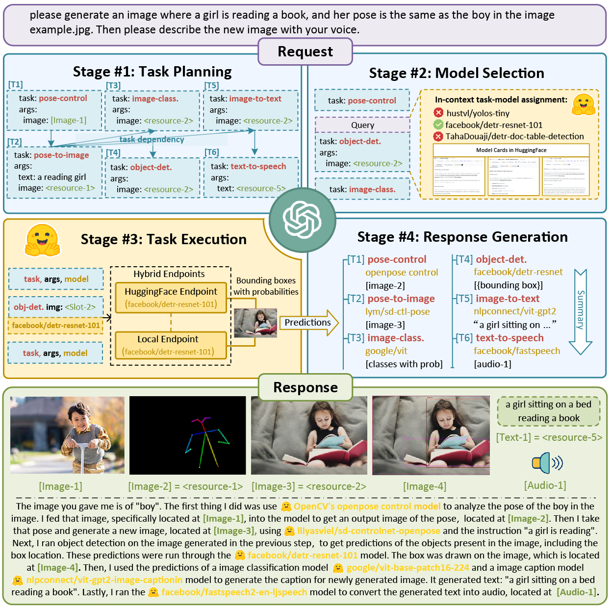

## Overview
In this project, we leverage natural Language as an interface for LLMs to connect numerous AI models for solving complicated AI tasks! We introduce a collaborative system that consists of **an LLM as the controller** and **numerous expert models as collaborative executors** (e.g., from HuggingFace Hub). The workflow of our system consists of four stages:
+ **Task Planning**: Using ChatGPT to analyze the requests of users to understand their intention, and disassemble them into possible solvable tasks.
+ **Model Selection**: To solve the planned tasks, ChatGPT selects expert models hosted on Hugging Face based on their descriptions.
+ **Task Execution**: Invokes and executes each selected model, and return the results to ChatGPT.
+ **Response Generation**: Finally, using ChatGPT to integrate the prediction of all models, and generate responses.

## Open-source Project
The source code of this project can be found by [https://github.com/microsoft/JARVIS](https://github.com/microsoft/JARVIS). The mission of JARVIS is to explore artificial general intelligence (AGI) and deliver cutting-edge research to the whole community.

## Research Themes

### Tool Use and Task Automation

[HuggingGPT](https://arxiv.org/abs/2303.17580) established an LLM-controller architecture that plans tasks, selects expert models, executes them, and integrates their results. [TaskBench](https://arxiv.org/abs/2311.18760) provides a large-scale benchmark for task automation and planning, while [EasyTool](https://arxiv.org/abs/2401.06201) compresses verbose tool documentation into concise instructions that are easier for agents to understand and use. The corresponding code and datasets are maintained in [JARVIS](https://github.com/microsoft/JARVIS), including its [EasyTool](https://github.com/microsoft/JARVIS/tree/main/easytool) and [TaskBench](https://github.com/microsoft/JARVIS/tree/main/taskbench) components.

### Agent Learning, Memory, and Multi-Agent Generation

[EvoAgent](https://openreview.net/forum?id=QPRpTAxPJM) automatically generates multi-agent systems through evolutionary operations. Our recent memory-augmented agent combines on-policy and off-policy optimization so that experience can support both stable learning and continued exploration [Liu et al., ICLR 2026](https://openreview.net/forum?id=UOzxviKVFO).

### Domain-specific Agent Systems

We develop agents whose reasoning and memory are grounded in specialized workflows. [Trade in Minutes!](https://openreview.net/forum?id=ROEwZAxqyS) builds a rationality-driven agentic system for quantitative financial trading. [AgentCF++](https://arxiv.org/abs/2502.13843) uses dual-layer and group-shared memory to model cross-domain preferences and popularity effects in recommendation.

### Computer-Use Agents and Evaluation

[WeaveBench](https://arxiv.org/abs/2606.09426) evaluates long-horizon agents that must coordinate graphical interfaces, terminals, code editors, browsers, and external tools in real-world tasks. [MedCUA-Bench](https://openreview.net/forum?id=gC1m98w7cq) specializes this direction for clinical workflows and screenshot-only interaction. Together, they test whether agents can execute complete workflows rather than isolated actions.

JARVIS also supports Azure OpenAI and GPT-4, and a lightweight HuggingGPT implementation is available in [LangChain](https://github.com/langchain-ai/langchain/tree/master/libs/experimental/langchain_experimental/autonomous_agents/hugginggpt).

## Reference
If you find this work useful in your method, you can cite the paper as below:
>
    @inproceedings{shen2023hugginggpt,
      author = {Shen, Yongliang and Song, Kaitao and Tan, Xu and Li, Dongsheng and Lu, Weiming and Zhuang, Yueting},
      booktitle = {Advances in Neural Information Processing Systems},
      title = {HuggingGPT: Solving AI Tasks with ChatGPT and its Friends in HuggingFace},
      year = {2023}
    }

>
    @article{shen2023taskbench,
      title   = {TaskBench: Benchmarking Large Language Models for Task Automation},
      author  = {Shen, Yongliang and Song, Kaitao and Tan, Xu and Zhang, Wenqi and Ren, Kan and Yuan, Siyu and Lu, Weiming and Li, Dongsheng and Zhuang, Yueting},
      journal = {arXiv preprint arXiv:2311.18760},
      year    = {2023}
    }

>
    @article{chen2023learning,
      title   = {Learning to teach large language models logical reasoning},
      author  = {Meiqi Chen, Yubo Ma, Kaitao Song, Yixin Cao, Yan Zhang, Dongsheng Li},
      journal = {arXiv preprint arXiv:2310.09158},
      year    = {2023}
    }
    
>
    @article{yuan2024easytool,
      title   = {EASYTOOL: Enhancing LLM-based Agents with Concise Tool Instruction},
      author  = {Siyu Yuan and Kaitao Song and Jiangjie Chen and Xu Tan and Yongliang Shen and Ren Kan and Dongsheng Li and Deqing Yang},
      journal = {arXiv preprint arXiv:2401.06201},
      year    = {2024}
    }

>
    @article{shen2024large,
      title={Large language models empowered autonomous edge AI for connected intelligence},
      author={Shen, Yifei and Shao, Jiawei and Zhang, Xinjie and Lin, Zehong and Pan, Hao and Li, Dongsheng and Zhang, Jun and Letaief, Khaled B},
      journal={IEEE Communications Magazine},
      year={2024},
      publisher={IEEE}
    }

>
    @article{yuan2024evoagent,
      title   = {EvoAgent: Towards Automatic Multi-Agent Generation via Evolutionary Algorithms},
      author  = {Siyu Yuan, Kaitao Song, Jiangjie Chen, Xu Tan, Dongsheng Li, Deqing Yang},
      journal = {arXiv preprint arXiv:2406.14228},
      year    = {2024}
    }

>
    @article{wu2024planning,
      title   = {Can Graph Learning Improve Task Planning?},
      author  = {Xixi Wu, Yifei Shen, Caihua Shan, Kaitao Song, Siwei Wang, Bohang Zhang, Jiarui Feng, Hong Cheng, Wei Chen, Yun Xiong, Dongsheng Li},
      journal = {arXiv preprint arXiv:2405.19119},
      year    = {2024}
    }
